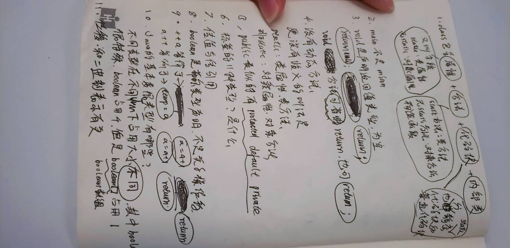

# learning-zhangzhuo

#### Git：

复制链接，clone到本地，从远程仓库更新就pull，提交到本地仓库就commit，推送到远程仓库就push，用小乌龟或者idea自带的，会比命令行更方便

Git相关的初始化配置、用法自己搜，需要:  
1、配置本地git的默认账号(邮箱密码)  
2、用邮箱地址生成ssh公钥  
3、公钥配置到github  
4、windows凭证管理或小乌龟、idea凭证管理打开  

5、git update-git-for-windows

https://www.liaoxuefeng.com/wiki/896043488029600/898732864121440

https://gitee.com/oschina/git-osc/wikis/%E5%B8%AE%E5%8A%A9

https://www.oschina.net/question/82993_133520

https://gitee.com/help/articles/4119#article-header0


#### 骚卓弟弟2020-11-25：




#### 快速设置— 如果你知道该怎么操作，直接使用下面的地址

我们强烈建议所有的git仓库都有一个`README`, `LICENSE`, `.gitignore`文件

Git入门？查看 [帮助](https://gitee.com/oschina/git-osc/wikis/帮助) , [Visual Studio](https://gitee.com/help/articles/4118) / [TortoiseGit](http://my.oschina.net/longxuu/blog/141699) / [Eclipse](https://gitee.com/help/articles/4119) / [Xcode](http://my.oschina.net/zxs/blog/142544) 下如何连接本站, [如何导入仓库](http://www.oschina.net/question/82993_133520)

#### 简易的命令行入门教程:

Git 全局设置:

```
git config --global user.name "〆、信仰"
git config --global user.email "296293760@qq.com"
```

创建 git 仓库:

```
mkdir learning-zhangzhuo
cd learning-zhangzhuo
git init
touch README.md
git add README.md
git commit -m "first commit"
git remote add origin https://gitee.com/we-genesis/learning-zhangzhuo.git
git push -u origin master
```

已有仓库?

```
cd existing_git_repo
git remote add origin https://gitee.com/we-genesis/learning-zhangzhuo.git
git push -u origin master
```